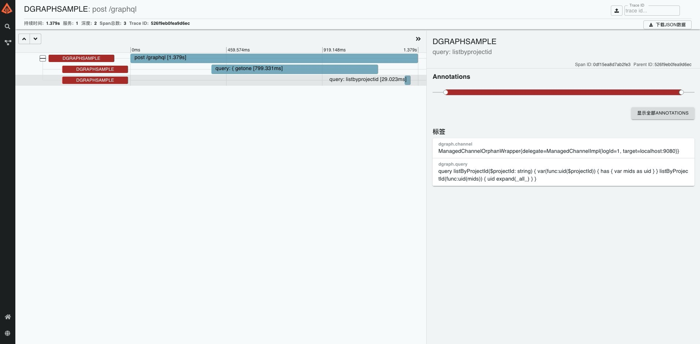

# Arc

 [](https://coveralls.io/github/YituHealthcare/Arc?branch=master) [](https://sonarcloud.io/dashboard?id=YituHealthcare_Arc) [](https://sonarcloud.io/dashboard?id=YituHealthcare_Arc) [](https://sonarcloud.io/dashboard?id=YituHealthcare_Arc)

基于GraphQL+Dgraph的DDD实现，配合SpringBoot使用

注: 基于 `SpringBoot 2.x`

## Module 

- core: 通用代码
- dgraph: 封装 Dgraph 数据库操作
- graphql: 提供 GraphQL 调用方式
- mq: 简易内嵌消息队列
- generator: 代码生成器。根据GraphQL Schema生成Java代码及Dgraph结构化语句


## 如何使用

1. 添加依赖，可根据需求单独使用

```xml
    <dependency>
        <groupId>ai.care</groupId>
        <artifactId>arc-graphql</artifactId>
        <version>1.0.0-SNAPSHOT</version>
    </dependency>
    <dependency>
        <groupId>ai.care</groupId>
        <artifactId>arc-dgraph</artifactId>
        <version>1.0.0-SNAPSHOT</version>
    </dependency>
```

2. 添加配置文件，可以参考 [full-sample#application-default.properties](./sample/full-sample/src/main/resources/application-default.properties)

通用配置

```properties
# 开启zipkin监控，默认开启
spring.zipkin.enabled=true
# 设置zipkin上报地址
spring.zipkin.base-url=http://localhost:9411
```

dgraph 配置

```properties
# 配置dgraph数据库地址
arc.dgraph.urls=localhost:9080,localhost:9081
```

graphql 配置

```properties
# graphql接口地址，默认为 graphql。配置后通过 POST http://localhost:port/graphql 访问
arc.graphql.path=graphql
# graphql schema文件目录，默认为 resources:graphql/schema.graphqls
arc.graphql.define=graphql
# 是否在请求后发送相应的DomainEvent，默认开启。如果没有消费者订阅相关topic，实际上不会发送
arc.graphql.event.enable=true
```
    
## 背景知识

- [GraphQL](./doc/GraphQL.md)
- [Dgraph](./doc/Dgraph.md)

## Manual

- [arc-GraphQL](./GraphQL/README.md)

## Sample

- [full-sample](./sample/full-sample)
- [GraphQL-sample](./sample/GraphQL-sample)
- [mq-sample](./sample/mq-sample)




## 整体开发流程


1. 定义GraphQL schema，产生GraphQL.schema文件
2. 定义dgraph schema，修改类型并定义type。
3. 创建javaBean并指定@DgraphType、@UidField、@RelationshipField
4. 创建 SimpleDgraphRepository 的子类声明为@Repository
5. 创建 @DataFetcherService类及@GraphQLQuery、@GraphQLMutation 方法
6. 通过 http://localhost:${port}/playground 直接create方法
7. 编写xxDgraph.xml实现query方法