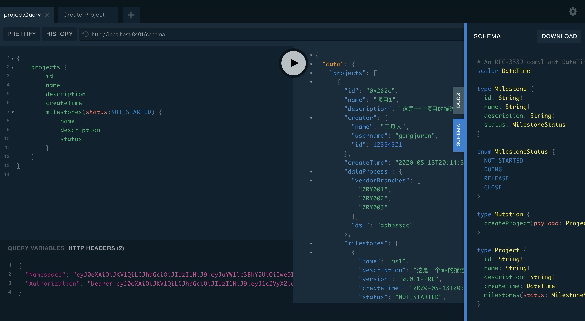

<p align="center">
    
</p>

  [](https://coveralls.io/github/YituHealthcare/Arc?branch=master) [](https://sonarcloud.io/dashboard?id=YituHealthcare_Arc) [](https://sonarcloud.io/dashboard?id=YituHealthcare_Arc) [](https://sonarcloud.io/dashboard?id=YituHealthcare_Arc)

通过`GraphQL Schema`描述业务领域，并提供一套基于`GraphQL`+`Dgraph`的开发框架，快速落地**DDD**。

注: 基于 `SpringBoot 2.x`

## Module 

- core: 通用代码
- dgraph: 封装 Dgraph 数据库操作
- graphql: 为 Spring 项目封装 Graphql 接口
- graphql-client: 提供调用Graphql Server Api 的能力，只依赖spring web 可独立使用
- mq: 简易内嵌消息队列
- generator: 代码生成器。根据GraphQL Schema生成Java代码及DgraphSchema


## 如何使用

可根据需求单独使用各组件. 配置文件，可以参考 [full-sample#application-default.properties](./sample/full-sample/src/main/resources/application-default.properties)

通用配置 

```properties
# 开启zipkin监控，默认开启
spring.zipkin.enabled=true
# 设置zipkin上报地址
spring.zipkin.base-url=http://localhost:9411
```

### 1. 提供Graphql接口

1.1 添加依赖

```xml
<dependency>
    <groupId>com.github.yituhealthcare</groupId>
    <artifactId>arc-graphql</artifactId>
    <version>1.4.0-SNAPSHOT</version>
</dependency>
```

1.2 创建schema. 默认路径为 `resources:graphql/schema.graphqls` 可以通过配置文件修改

```graphql
schema{
    query: Query,
    mutation: Mutation
}

type Query{
    projects(name: String): [Project]
}

type Mutation{
    createProject(payload: ProjectInput): Project
}

type Project{
    id: String!
    name: String!
    description: String!
    createTime: DateTime!
}

input ProjectInput{
    name: String!
    description: String!
}
```

1.3 编写java代码

如果有 `Consumer` 订阅，graphql调用之后会发送对应的领域事件给 `Consumer` 进行消费

服务启动后可以

- 访问 http://localhost:${port}/playground 进行方法调用
- 访问 http://localhost:${port}/voyager 查询领域关系

```java
@SpringBootApplication
public class Application {

    public static void main(String[] args) {
        SpringApplication.run(Application.class, args);
    }

    @GraphqlQuery
    public DataFetcher<List<Project>> projects() {
        return dataFetchingEnvironment -> {
            String name = dataFetchingEnvironment.getArgument("name")
            return Arrays.asList(new Project());
        };
    }

    @GraphqlMutation
    public DataFetcher<Project> createProject() {
        return dataFetchingEnvironment -> {
            ProjectInput input = GraphqlPayloadUtil.resolveArguments(dataFetchingEnvironment.getArguments(), ProjectInput.class);
            OffsetDateTime now = OffsetDateTime.now();
            Project project = new Project();
            return project;
        };
    }

    @Consumer(topic = "projects")
    public void listener(Message<DomainEvent> record){}

    static class Project {
        public String id;
        public String name;
        public String description;
        public OffsetDateTime createTime;
    }
    static class ProjectInput {
        private String name;
        private String description;
    }
}
```

### 2. 调用dgraph数据库

可以通过`docker`命令在本地启动`dgraph`数据库

```shell script
docker run --rm -it -p 8080:8080 -p 9080:9080 -p 8000:8000 -v ~/dgraph:/dgraph dgraph/standalone:v20.03.0
```

2.1 添加依赖

```xml
    <dependency>
        <groupId>com.github.yituhealthcare</groupId>
        <artifactId>arc-dgraph</artifactId>
        <version>1.4.0-SNAPSHOT</version>
    </dependency>
```

2.2 配置文件

```properties
# 配置dgraph数据库地址
arc.dgraph.urls=localhost:9080
```

2.3 编写查询语句和java代码

`SimpleDgraphRepository` 提供了 `save()` 、 `getOne()` 等常用方法，如果要进行复杂操作需要另外编写操作语句

查询语句

```xml
<dgraph>
    <var id="type">
        PROJECT
    </var>
    <var id="common">
        uid
        expand(PROJECT)
    </var>
    <query id="listByProjectId">
        query listByName($name: string) {
            listByName(func: eq(name, $name)) {
                $common
            }
        }
    </query>
    <mutation id="updateName">
        <![CDATA[
            <$id> <PROJECT.name> "$name" .
        ]]>
    </mutation>
</dgraph>

```

java代码

```java
@Repository
public class ProjectRepository extends SimpleDgraphRepository<Project> {

    public List<Project> listByName(String name) {
        Map<String, String> vars = new HashMap<>();
        vars.put("name", name);
        return this.queryForList("project.listByName", vars);
    }

    public void updateName(String name) {
        Map<String, String> vars = new HashMap<>();
        vars.put("name", name);
        this.mutation("project.updateName", vars);
    }

}
```

### 3. 通过graphql-client调用graphql服务

3.1 添加依赖

```xml
    <dependency>
        <groupId>com.github.yituhealthcare</groupId>
        <artifactId>arc-graphql-client</artifactId>
        <version>1.4.0-SNAPSHOT</version>
    </dependency>
```

3.2 编写调用语句 

新建文件 resources:ql/echo.graphql

```graphql
query hello($echoText: String!) {
    echo(text:$echoText)
}
```

3.3 编写java代码

```java
@EnableGraphqlClients(basePackages = "com.github.yituhealthcare.arcgraphqlclientsample")
@RestController
@SpringBootApplication
public class ArcGraphqlClientSampleApplication {

    public static void main(String[] args) {
        SpringApplication.run(ArcGraphqlClientSampleApplication.class, args);
    }

    @Autowired
    private GitlabGraphqlClient gitlabGraphqlClient;

    @RequestMapping("rest")
    public String rest(@RequestParam(required = false, defaultValue = "Arc") String name) {
        return gitlabGraphqlClient.echo("Hello " + name).getData();
    }

    @GraphqlClient(value = "gitlabGraphqlClient", url = "https://gitlab.com/api/graphql")
    interface GitlabGraphqlClient {
        @GraphqlMapping(path = "ql/echo.graphql")
        GraphqlResponse<String> echo(@GraphqlParam("echoText") String text);
    }
}
```

### 4. 通过Generator生成代码

4.1 依赖中添加Maven插件

```xml
<build>
    <plugins>
        <plugin>
            <groupId>com.github.yituhealthcare</groupId>
            <artifactId>arc-maven-plugin</artifactId>
            <version>1.4.0-SNAPSHOT</version>
        </plugin>
    </plugins>
</build>
```

4.2 新建配置文件， 默认路径为 `resources:arc-generator.json` 可以通过plugin配置修改

```json
{
  "basePackage": "com.github.yituhealthcare.arcgeneratorsample",
  "dropAll": false,
  "genStrategies": [
    {
      "codeGenOperation": "SKIP",
      "codeGenType": "REPO"
    },
    {
      "codeGenOperation": "OVERRIDE",
      "codeGenType": "API"
    }
  ],
  "ignoreJavaFileNames": [
    "User"
  ],
  "dgraphPath": "dgraph/schema.dgraph"
}
```

4.3 执行maven命令

```shell script
mvn arc:generate
```

## Manual

- [arc-graphql](./graphql/README.md)
- [arc-maven-plugin](./maven-plugin/README.md)
- [arc-graphql-client](./graphql-client/README.md)
- [arc-generator](./generator/README.md)

## Sample

- [full-sample](./sample/full-sample)
- [graphql-sample](./sample/graphql-sample)
- [mq-sample](./sample/mq-sample)
- [generator-sample](./sample/generator-sample)

## 背景知识

- [GraphQL](./doc/GraphQL.md)
- [Dgraph](./doc/Dgraph.md)

## 示例





## 整体开发流程


1. 定义GraphQL schema，产生GraphQL.schema文件
2. 定义dgraph schema，修改类型并定义type。
3. 创建javaBean并指定@DgraphType、@UidField、@RelationshipField
4. 创建 SimpleDgraphRepository 的子类声明为@Repository
5. 创建 @Graphql类及@GraphQLQuery、@GraphQLMutation 方法
6. 通过 http://localhost:${port}/playground 直接create方法
7. 编写xxDgraph.xml实现query方法

## Support

We would like to thank [JetBrains](https://www.jetbrains.com/?from=Arc) for sharing free open-source licences of amazing tools.

[](https://www.jetbrains.com/?from=Arc)